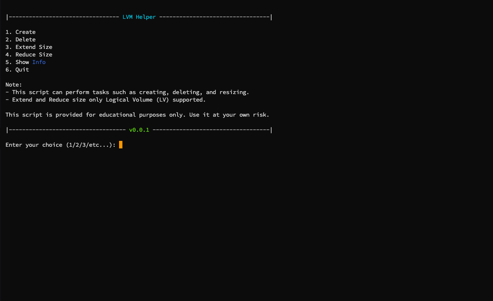
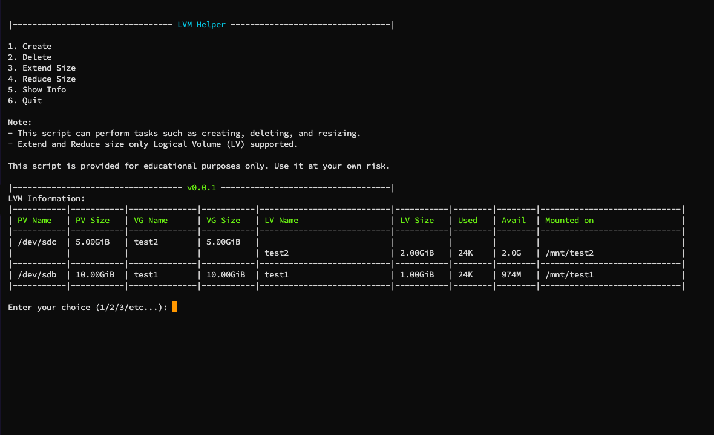

# Automation LVM Script

This script functions as an automated for creating Logical Volume Management (LVM) volumes. You can perform tasks such as creating, deleting, and resizing logical volumes.





## Usage

To grab this script run this following command:

```bash
wget -qO lvm-helper.sh https://raw.githubusercontent.com/imoize/lvm-helper/main/lvm-helper.sh
```

Make file executable:
```bash
sudo chmod +x lvm-helper.sh
```

Run Script:
```bash
sudo ./lvm-helper.sh
```
NOTE: Login as root or use  sudo to use this script.

## Disclaimer:
This script is provided for educational purposes only. Use it at your own risk.

The author is not responsible for any consequences or damages resulting from the use of this script.

If you choose to run this script, make sure you understand the code and its implications.

See what this [script](./lvm-helper.sh) does.